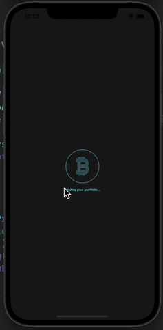

# CryptoTracker
A Crypto Tracking App

## Summary
This is a crypto tracking app using the CoinGecko to get data about coins, and users are able to add coins to their portfolio to keep track of them. Data is saved using CoreData and everything is coded in SwiftUI. (THE APP STILL HAS SIGNUP/SIGNIN YET TO BE IMPLEMENTED)

## Built With
* [SwiftUI](https://developer.apple.com/tutorials/swiftui)
* [UIKit](https://developer.apple.com/documentation/uikit)
* [CoinGeckAPI](https://www.coingecko.com/en/api)

## Gif of App


## Installation Steps For Local Running
1. Clone project.
2. Open terminal
3. cd 'your-desired-path'
4. git clone 'paste-link-here'
5. open project in Xcode and run

## Code Snippet Of Getting Coin Image Service
```swift
private func getCoinImage() {
        
        if let savedImage = fileManager.getImage(imageName: imageName, folderName: folderName) {
            image = savedImage
            print("Retrieved image from File Manager!")
        } else {
            downloadCoinImage()
            print("Downloading image now!")
        }
    }
```


## Author

* **Mehdi Safari**

- [Link to Github](https://github.com/mehdisafari77)
- [Link to LinkedIn](https://www.linkedin.com/in/mehdi-safari-992799142/)
